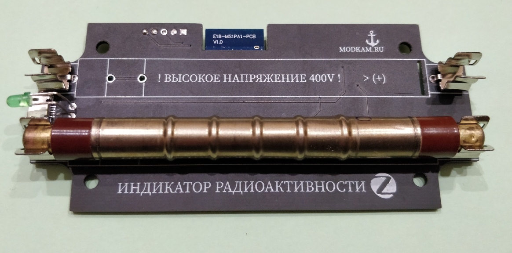
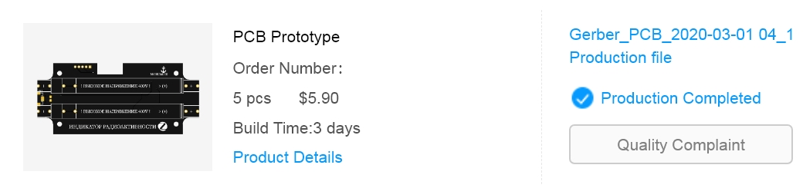
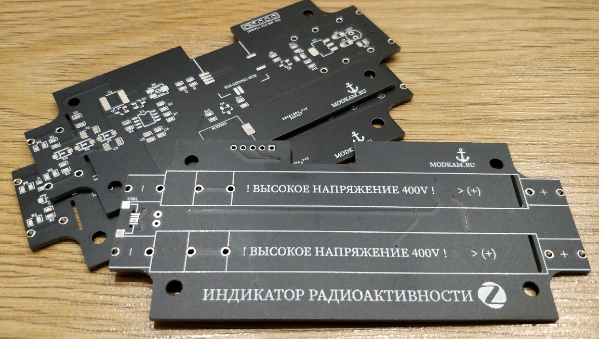
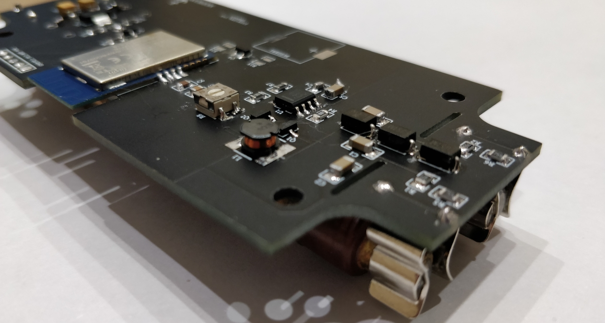
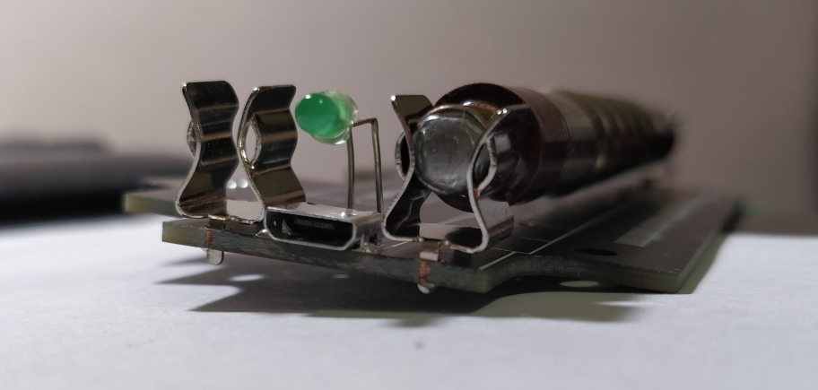

We all know what radiation is and its harmful effects on humans. Since this danger is not tangible, in connection with this the idea was born to make an indicator for continuous monitoring of the radiation situation.

The device is not designed to measure the level of radiation in the epicenter of a nuclear explosion, but it allows you to constantly monitor changes in background values. This can be useful in the event of man-made disasters or when you yourself or others bring something with an increased background radiation into the house. These can be quite harmless-looking things, nevertheless, they carry a direct threat to life and health.

There are many amateur dosimeter projects, for example one and two.
All of them are built according to almost the same schemes associated with the features of the Geiger counters used. The principle of operation of Geiger counters is based on the effect of impact ionization of a gaseous medium under the action of radioactive particles in the interelectrode space at a high accelerating voltage. Accordingly, the meter requires a high voltage source.

**ATTENTION! THE DEVICE CONTAINS A HIGH VOLTAGE OF 400 VOLTS**

Since Jager has a Zigbee network at home, the device will be an element of this network.
The circuit does not contain rare elements and is typical for this type of device.

### Diagram

The central elements are the SBM-20 Geiger counter and the E18-MS1PA1-PCB Zigbee module. The scheme includes the ability to use either one or two counters to improve the measurement accuracy.
  

GAINTA 407 case was selected based on the meter size.
  

### PCB
The board was designed by EasyEDA
  

  

Production at JLCPCB
  

  

The general assembly has no peculiarities, the smallest SMD elements are 0805. The capacitors in the voltage multiplier are 600 volts and are 1206 in size. There is a trimmer resistor on the board to set the high voltage level.
  

There is a peculiarity in sealing the meter holders, since the width of the case does not allow placing two meters and the micro USB connector at a sufficient distance from each other, the holders must be raised above the board. When soldering, use any 0.8-1.0 mm spacer
  

Physically, you can install counters 90 or 107 mm long.
Such as Soviet SBM-20 and SBM-19 or Chinese J305 and M4011.

To revive the device @anonymass wrote an open source firmware. The firmware implements support for several counters, displaying the number of registered particles per minute with the conversion of these values ​​to the usual μR / h. An important feature is the ability to set the level at which the alarm is triggered. This condition can be tied to the triggering of a physical siren or light bulb as a means of control and using direct binding on the Zigbee device, which will enable notification even if the Zigbee network is not available.

If the board is correctly assembled, after downloading the firmware, it will be possible to "see" the registered particles immediately  

### Support
Device support is implemented in zigbee2mqtt and SLS Gateway

   
   

  
  

### Settings
* alert_threshold - set the level in μR / h, when exceeded, the alarm will be triggered

* buzzer - built-in buzzer (not yet supported)

* Led - turn on / off the LED displaying particle registration
* rph - recorded value in μR / h
* pm - recorded value of particles per minute
* sensitivity - counter sensitivity (used if item 3 is selected in sensor_type)
* sensor_type - select the type of meter:
  * SBM-20 / STS-5 / BOI-33
  * SBM-19 / STS-6
  * everything else

* sensors_count - number of installed counters

The device is also a router in the Zigbee network, which allows you to increase its coverage.
  

The final assembly includes installing the board into the case and making an end cap with holes for the LED and micro USB connector. These holes can be made in a standard plug, but Jager drew and printed on a 3D printer
  

  

That's all, the device is ready to go.

In the photos you can see that Jager's counters are damaged, it so happened that Jager got just such. In fact, the damage is much more serious and this can be seen in the photo below, but while maintaining the tightness, they do not affect the operation of the meters.
  

### How to join
 * Reset to FN rebooting device 5 times with interval less than 10 seconds, led will start flashing during reset  

### Files to reproduce
* [Gerbers and BOM and STL](https://github.com/diyruz/geiger/tree/master/hardware) by [Jager](https://t.me/Jager_f)  
* [Firmware](https://github.com/diyruz/geiger/releases) by [@anonymass](https://t.me/anonymass)  

[Original post by Jager](https://modkam.ru/?p=1591)  
